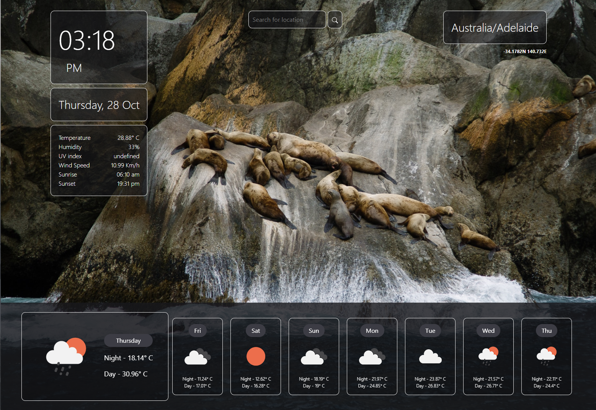

# Weatherex - Weather Dashboard Project

## Description 
Welcome to the Weatherex, a weather webapp that displays your locations weather instantaneously. Through the utilization of the OpenWeather API, this webapp displays accurate information of the selected location’s weather and a future forecast of 7-days to allow the user a comprehensive understanding of their location’s climate. 

With a sleek and modern User Interface, this webapp allows the user to navigate throughout it without hinderances or issues. 

The webapp is designed to ask the user to allow the webapp to automatically analyze the location without any search input entered, however if there are limitations in the function, the webapp than asks the user to input their location into search bar and manually acquire the weather forecast. 

## Table of Contents - Weatherex - Weather Dashboard - Project

- [Project](#Project)
- [Website](#Website)
- [License](#license)
- [Contribute](#contribute)

## Project
The following screenshot showcases the weather dashboard of Weatherex and its functioning user interface. 



## Website

To access the weather dashboard of Weatherex, please click on the following link: 
https://gurtej154.github.io/Weatherex-project/

## License
Copyright (c) 2021 Gurtej Singh

Permission is hereby granted, free of charge, to any person obtaining a copy of this software and associated documentation files (the "Software"), to deal in the Software without restriction, including without limitation the rights to use, copy, modify, merge, publish, distribute, sublicense, and/or sell copies of the Software, and to permit persons to whom the Software is furnished to do so, subject to the following conditions:

The above copyright notice and this permission notice shall be included in all copies or substantial portions of the Software.

THE SOFTWARE IS PROVIDED "AS IS", WITHOUT WARRANTY OF ANY KIND, EXPRESS OR IMPLIED, INCLUDING BUT NOT LIMITED TO THE WARRANTIES OF MERCHANTABILITY, FITNESS FOR A PARTICULAR PURPOSE AND NONINFRINGEMENT. IN NO EVENT SHALL THE AUTHORS OR COPYRIGHT HOLDERS BE LIABLE FOR ANY CLAIM, DAMAGES OR OTHER LIABILITY, WHETHER IN AN ACTION OF CONTRACT, TORT OR OTHERWISE, ARISING FROM, OUT OF OR IN CONNECTION WITH THE SOFTWARE OR THE USE OR OTHER DEALINGS IN THE SOFTWARE.

## How to Contribute
To contribute, modify or edit in general; 
- Open Visual Studio Code
- Open or create a new project folder 
- Open a integrated terminal or git bash 
- Attain the repo link from this repository


```
HTTPS
https://github.com/gurtej154/Weatherex-project.git

or

SSH
git@github.com:gurtej154/Weatherex-project.git
```
- Enter git clone 
```
HTTPS
https://github.com/gurtej154/Weatherex-project.git

or

SSH
git@github.com:gurtej154/Weatherex-project.git
```
- Start accessing the project's content!
